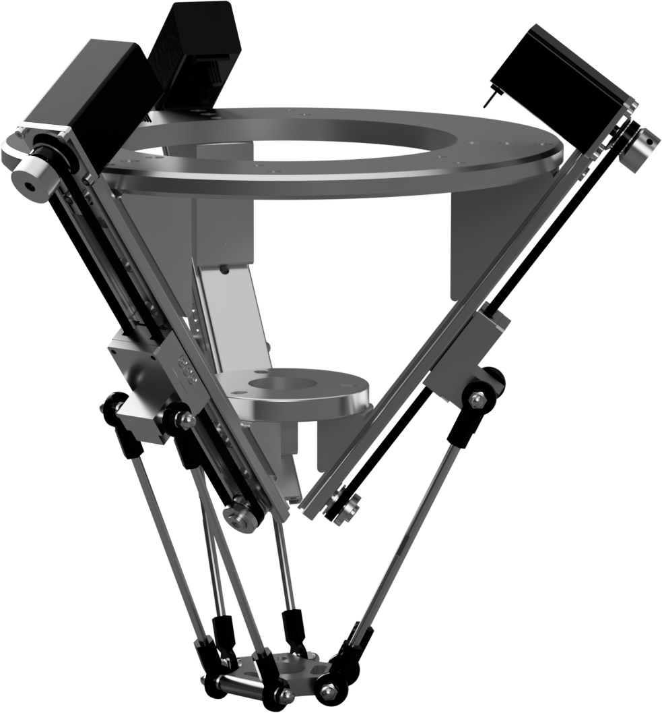
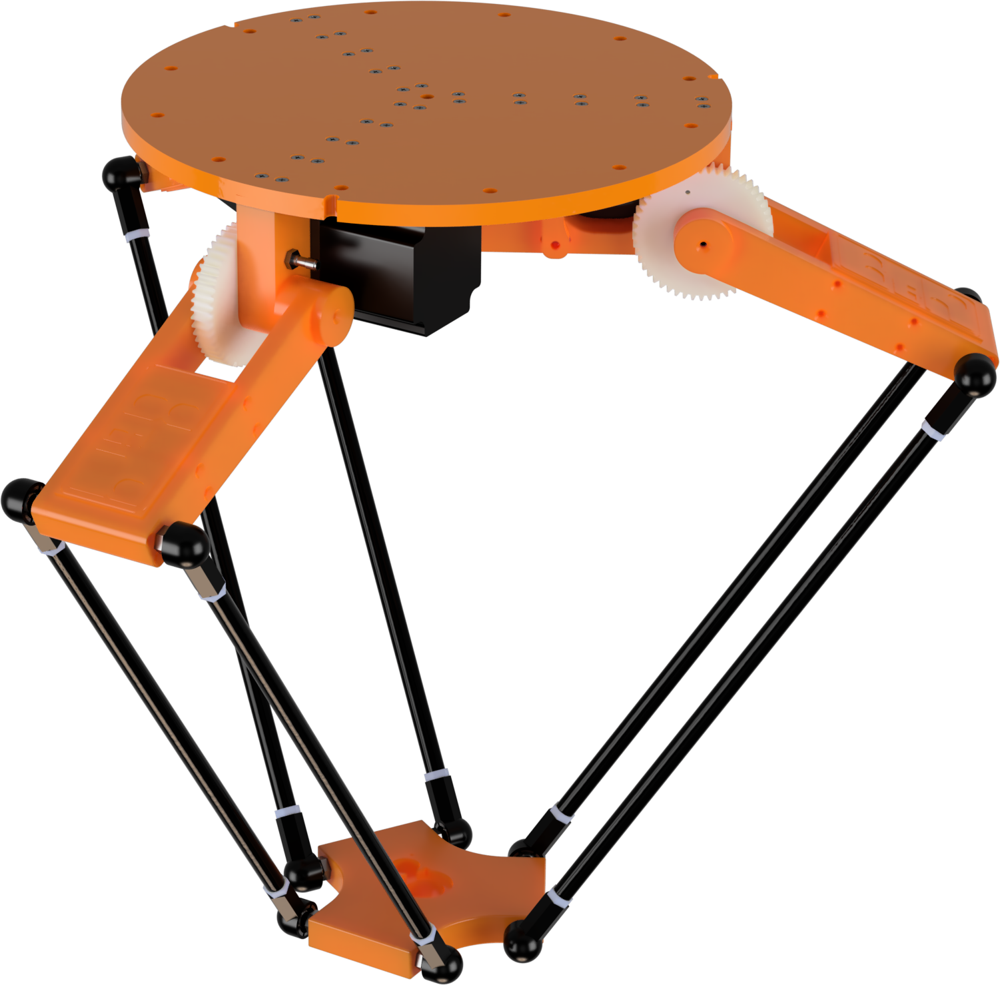
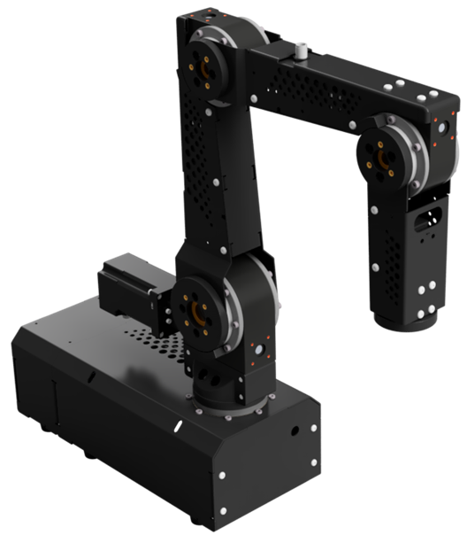

# Education Network Teachware Projects

## Contact
If you have any questions about these projects please [Contact Us](mailto:education.de@br-automation.com).

***

## Helpful Documents

[**Here**](./00_Helpful%20Documents/) you'll find two very helpful documents. Both documents are available in english and german. The EduCheats is a Automation Studio CheatSheet that provides the most important steps in Automation Studio and the EduCompass contains the best resources for self-study to give you a perfekt start with your B&R project. 

***
 

# Projects

## Delta Robots

### Igus Delta
 

 

[**This**](/01_Robotic/Delta/igusDelta_V2.01.1.zip) is a sample project to run a igus delta robot with a B&R PLC. For more information have a look at the link below.

[**For a detailed description see this link**](/01_Robotic/Delta/igusDeltaGuide_V2.01.0.pdf)

### 3D printed Delta

 

 

[**This**](/01_Robotic/Delta/PlotbotDelta_V2.01.1.zip) is a sample project to run a 3D printed 3-axis delta robot with a B&R PLC. To get the 3D print files please contact education.de@br-automation.com. For more information have a look at the link below.

[**For a detailed description see this link**](/01_Robotic/Delta/PlotbotDeltaGuide_V2.01.0.pdf)

***

## Robo Arms

### Igus 5-Axis Robolink Projects
 

 

#### Igus Robolink RL-D-RBT-3322S-BF

[**This**](/01_Robotic/5-Axis%20RoboArm/igusRobolink3322S_V2.01.0.zip) is a sample project to run the 5-axis igus robolink RL-D-RBT-3322S-BF robot with a B&R PLC. For more information have a look at the link below.

#### Igus Robolink RL-D-RBT-5532S-BF

[**This**](/01_Robotic/5-Axis%20RoboArm/igusRobolink5532S_V2.01.0.zip) is a sample project to run the 5-axis igus robolink RL-D-RBT-5532S-BF robot with a B&R PLC. For more information have a look at the link below.

 

[**For a detailed description to these projects see this link**](/01_Robotic/5-Axis%20RoboArm/IgusGuide_V2.01.0.pdf)

***